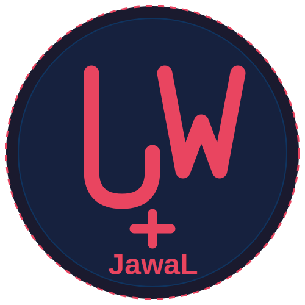

# JawaL - أداة إدارة سطح الهجوم واختبار الاختراق

<p align="center">
  
</p>

<p align="center">
أداة شاملة لإدارة سطح الهجوم وجمع المعلومات الاستخباراتية
</p>

<p align="center">
  <a href="https://github.com/SaudiLinux/JawaL/actions/workflows/python-tests.yml">
    
  </a>
  <a href="https://github.com/SaudiLinux/JawaL/actions/workflows/python-lint.yml">
    
  </a>
  <a href="LICENSE">
    
  </a>
  <a href="https://github.com/SaudiLinux/JawaL/releases">
    
  </a>
  <a href="https://github.com/SaudiLinux/JawaL/issues">
    
  </a>
</p>

## نظرة عامة
JawaL هي أداة قوية مكتوبة بلغة Python تعمل على نظام لينكس وويندوز لإدارة سطح الهجوم وإجراء اختبارات الاختراق الآلية. تقوم الأداة بجمع معلومات مفصلة عن الأهداف باستخدام أرقام الهواتف وأسماء المستخدمين، وتحليل مواقع التواصل الاجتماعي، والبحث عن الحسابات المرتبطة وعناوين البريد الإلكتروني.

### حالة المشروع

المشروع حاليًا في مرحلة التطوير النشط. نحن نعمل باستمرار على تحسين الأداة وإضافة ميزات جديدة. يمكنك متابعة التقدم والخطط المستقبلية في [خارطة الطريق](docs/roadmap.md).

## الميزات الرئيسية
- البحث برقم الهاتف المحمول واسم المستخدم
- اختبار الاختراق الآلي
- فحص مواقع التواصل الاجتماعي والعثور على الحسابات المرتبطة
- جمع المعلومات المفصلة عن الهدف بشكل آلي
- مسح آلي على مزود خدمة الهاتف المحمول
- فحص خادم الويب للثغرات
- اختبار ثغرات WordPress و Joomla
- واجهة سطر أوامر بسيطة وفعالة
- تتبع الأصول والخدمات
- إنشاء تقارير تفصيلية عن نقاط الضعف

## المتطلبات
- Python 3.6 أو أحدث
- المكتبات المذكورة في ملف requirements.txt

## البدء السريع

```bash
# استنساخ المستودع
git clone https://github.com/SaudiLinux/JawaL.git
cd JawaL

# تثبيت المتطلبات
pip install -r requirements.txt

# تشغيل الأداة للحصول على المساعدة
python main.py --help

# مثال: فحص رقم هاتف
python main.py --phone +966501234567
```

للحصول على تعليمات تفصيلية حول التثبيت، راجع [دليل التثبيت](docs/installation.md).

## التثبيت

### باستخدام سكربتات التشغيل

#### على نظام ويندوز

```
run.bat
```

#### على نظام لينكس

```
chmod +x run.sh
./run.sh
```

### التثبيت اليدوي

```bash
# استنساخ المستودع
git clone https://github.com/SaudiLinux/JawaL.git
cd JawaL

# إنشاء بيئة افتراضية
python -m venv venv

# تفعيل البيئة الافتراضية
# على نظام ويندوز
venv\Scripts\activate
# على نظام لينكس
source venv/bin/activate

# تثبيت المتطلبات
pip install -r requirements.txt

# تثبيت الأداة
pip install -e .
```

### باستخدام Docker

```bash
# استنساخ المستودع
git clone https://github.com/SaudiLinux/JawaL.git
cd JawaL

# بناء صورة Docker
docker build -t jawal .

# تشغيل JawaL باستخدام Docker
docker run -it --rm jawal --help
```

للمزيد من المعلومات حول استخدام Docker، راجع [دليل Docker](docs/docker.md).

## الاستخدام الأساسي

### فحص رقم هاتف

```bash
python main.py --phone +966501234567
```

### فحص اسم مستخدم

```bash
python main.py --username johndoe
```

### فحص موقع ويب

```bash
python main.py --url https://example.com
```

### فحص موقع ووردبريس

```bash
python main.py --wordpress https://example.com
```

### فحص موقع جوملا

```bash
python main.py --joomla https://example.com
```

## الخيارات المتقدمة

### تحديد المنافذ

```bash
python main.py --url https://example.com --ports 80,443,8080-8090
```

### تحديد مجلد الإخراج

```bash
python main.py --url https://example.com --output reports/web
```

### تحديد تنسيق التقرير

```bash
python main.py --url https://example.com --format html
```

### تفعيل وضع التفصيل

```bash
python main.py --url https://example.com --verbose
```

## التوثيق

للحصول على معلومات أكثر تفصيلاً، يرجى الاطلاع على المستندات التالية:

- [دليل التثبيت](docs/installation.md)
- [دليل الاستخدام](docs/usage.md)
- [الأمثلة](docs/examples.md)
- [استخدام Docker](docs/docker.md)
- [دليل التطوير](docs/development.md)
- [التكامل المستمر والنشر المستمر (CI/CD)](docs/ci_cd.md)
- [التوثيق التقني](docs/technical.md)
- [الأسئلة الشائعة](docs/faq.md)
- [توثيق واجهة برمجة التطبيقات](docs/api.md)
- [خارطة الطريق](docs/roadmap.md)

## المساهمة

نرحب بمساهماتكم! يمكنك المساهمة في تطوير JawaL بعدة طرق:

- تقديم تقارير الأخطاء والاقتراحات عبر [GitHub Issues](https://github.com/SaudiLinux/JawaL/issues)
- تحسين التوثيق والترجمة
- إضافة ميزات جديدة أو إصلاح الأخطاء الموجودة
- مشاركة المشروع ونشره

يرجى الاطلاع على المستندات التالية قبل المساهمة:

- [دليل المساهمة](CONTRIBUTING.md)
- [دليل التطوير](docs/development.md)
- [مدونة قواعد السلوك](CODE_OF_CONDUCT.md)

## الأمان

نحن نأخذ أمان JawaL على محمل الجد. إذا اكتشفت أي ثغرات أمنية، يرجى اتباع إرشادات الإبلاغ عن الثغرات في [سياسة الأمان](SECURITY.md).

## سجل التغييرات

لمعرفة جميع التغييرات والإصدارات الجديدة، يرجى الاطلاع على [سجل التغييرات](CHANGELOG.md).

## الترخيص

هذا المشروع مرخص بموجب [رخصة MIT](LICENSE).

## المطور

- الاسم: Saudi Linux
- البريد الإلكتروني: SaudiLinux7@gmail.com

## إخلاء المسؤولية
تم تطوير هذه الأداة لأغراض تعليمية واختبار الاختراق الأخلاقي فقط. يجب استخدامها فقط على الأنظمة التي لديك إذن صريح لاختبارها. المطور غير مسؤول عن أي استخدام غير قانوني أو غير أخلاقي لهذه الأداة.